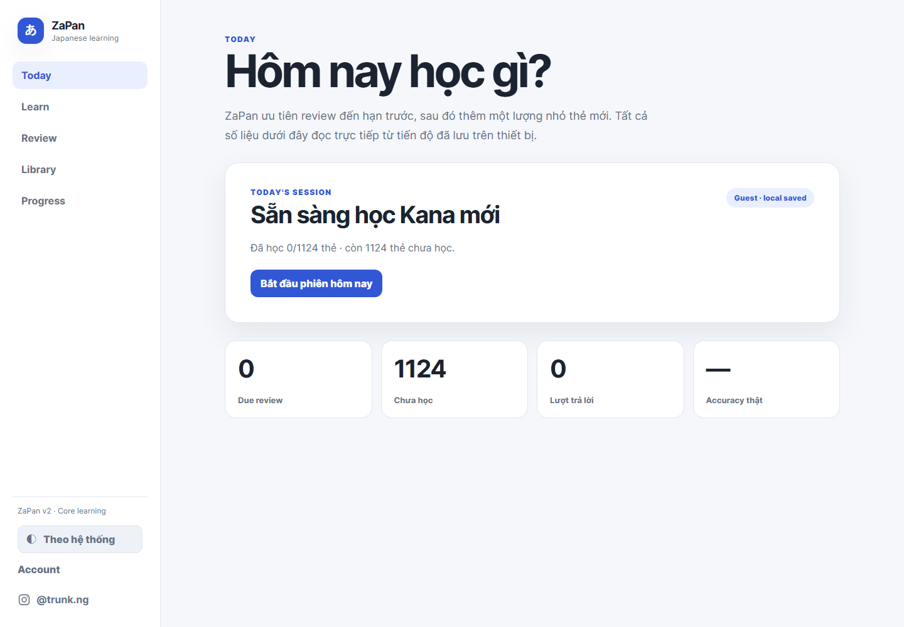
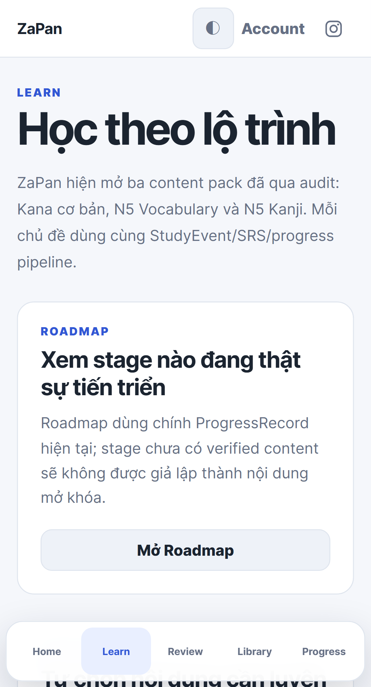

# ZaPan v2

ZaPan is a Japanese-learning web application built around one learning loop: **Learn → Review → Practice → Measure → Adapt**.

**Website:** https://trungnguyencore.github.io/zapan/

## Learning scope

The current ZaPan repository contains **3,867 learnable cards**:

- 92 basic Hiragana/Katakana cards;
- 923 audited N5 vocabulary cards across 15 topics;
- 109 audited N5 Kanji cards across 10 topics;
- 569 N4 vocabulary + 140 N4 Kanji cards from a pinned OpenJLPT study set;
- 1,668 N3 vocabulary + 366 N3 Kanji cards from the same pinned OpenJLPT study set.

The OpenJLPT snapshot contains 798 raw N4 records and 2,151 raw N3 records. ZaPan applies a **lower-level prompt wins** rule (N5 → N4 → N3) so the same vocabulary term or Kanji character does not create parallel SRS records. This retains 709 N4 cards and 2,034 N3 cards, excluding 206 higher-level duplicate prompts while preserving the raw source snapshot and an exclusion report.

N4/N3 are presented as **open-data study sets**, not official JLPT lists. The JLPT organization does not publish official current vocabulary or Kanji lists. Grammar, Reading, Listening and exam-practice content remain inactive until their own sourced, versioned and tested pipelines exist.

## Product surfaces

Primary learning:

- Today — recommended due/new work from real progress;
- Learn — topic-based Kana, audited N5, and sourced N4/N3 Vocabulary/Kanji study sets;
- Review — due-card review;
- Library — search/filter across the 3,867-card repository;
- Progress — persisted activity, mastery, streak and heatmap;
- Roadmap — six stages backed by real content/progress: Hiragana, Katakana, N5 Vocabulary, N5 Kanji, N4 open study set and N3 open study set.

Practice surfaces use the same canonical StudyEvent/SRS/progress model:

- Custom Practice;
- Writing Recall;
- Time Attack;
- Survival;
- Match;
- Confusables.

## Content provenance

N4/N3 source snapshot:

- **Project:** OpenJLPT
- **Pinned commit:** `c42fd9fa3777bfc1775446f7c418d549dfd6e4cf`
- **Dataset license:** CC BY-SA 4.0
- **ZaPan source manifest:** `app/content-sources/openjlpt/SOURCE_MANIFEST.json`
- **ZaPan duplicate exclusion report:** `app/content-sources/openjlpt/DEDUPLICATION_REPORT.json`
- **Upstream notice/license snapshot:** `app/content-sources/openjlpt/NOTICE.md` and `LICENSE`

OpenJLPT attributes vocabulary readings/glosses to JMdict/EDICT/EDRDG, Kanji metadata to KANJIDIC2/EDRDG, and N5–N1 level assignments to Jonathan Waller's community JLPT resources. ZaPan preserves that attribution and distributes the derived OpenJLPT dataset under CC BY-SA 4.0.

Generated ZaPan modules are reproducible:

```bash
cd app
npm run generate:openjlpt
```

English meanings from the source are preserved for N4/N3. ZaPan does **not** silently AI-translate thousands of entries into Vietnamese and present those translations as sourced facts; cards without reviewed Vietnamese meaning display the source-backed English meaning.

## Screenshots

### Today — desktop



### Learn — mobile



## Persistence and accounts

Core study is local-first through IndexedDB. Guest learning works without an account.

Optional Email/Password accounts use the ZaPan v2 Firebase project for cloud event synchronization. Offline events remain durable locally and converge through the immutable event journal when synchronization resumes.

## Engineering

- React 19 + TypeScript + Vite;
- React Router;
- Dexie / IndexedDB;
- Firebase Authentication + Cloud Firestore;
- runtime-validated, versioned content bundles;
- pinned source manifests + deterministic OpenJLPT generator;
- Vitest + Testing Library;
- Playwright desktop/mobile regression;
- executable JS bundle budgets;
- GitHub Pages deployment through GitHub Actions.

The production GitHub Pages build uses the project prefix `/zapan/` and includes an SPA `404.html` fallback for direct/deep routes.

## Local development

```bash
cd app
npm ci
npm run dev
```

Main verification commands:

```bash
npm run generate:openjlpt
npm run check
npm run test:firebase:emulated
npm run test:e2e
npm run test:e2e:release
```

The production-cloud smoke test intentionally creates and cleans a temporary Firebase test account and data:

```bash
npm run test:e2e:production
```

## Repository state and evidence

Project status and verification are source-grounded in:

- `PROJECT_PROGRESS.md`
- `PROJECT_EVIDENCE.md`
- `PROJECT_DECISIONS.md`
- `WEB_ROADMAP.md`
- `implementation.md`

Legacy ZaPan history is retained in Git and preserved through rollback refs from the v2 production migration.

## Owner

Built by [@trunk.ng](https://www.instagram.com/trunk.ng/).
